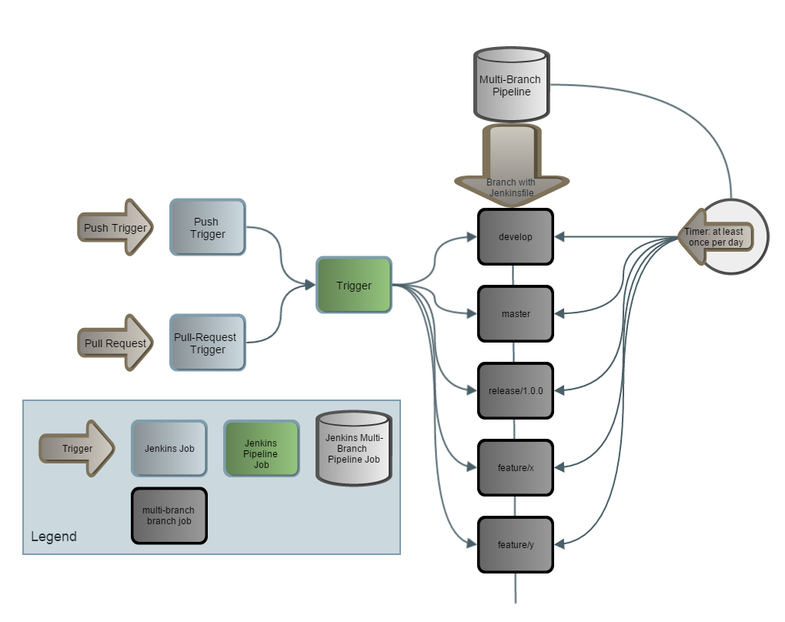
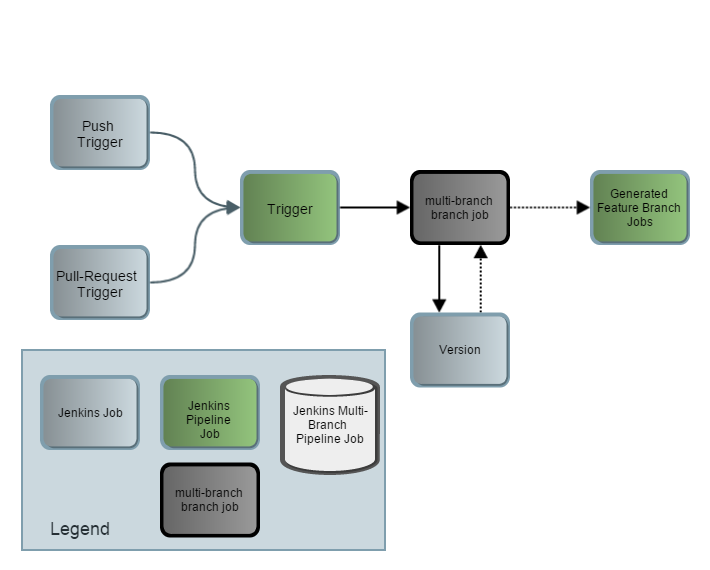

Jenkins-Pipeline is free software: you can redistribute it and/or modify
   it under the terms of the GNU General Public License as published by
   the Free Software Foundation, either version 3 of the License, or
   (at your option) any later version.

   Jenkins-Pipeline is distributed in the hope that it will be useful,
   but WITHOUT ANY WARRANTY; without even the implied warranty of
   MERCHANTABILITY or FITNESS FOR A PARTICULAR PURPOSE.  See the
   GNU General Public License for more details.

   You should have received a copy of the GNU General Public License
   along with Jenkins-Pipeline.  If not, see <http://www.gnu.org/licenses/>.

# Table of Contents
   1. [Jenkins Pipeline Plugin](#Jenkins-Pipeline-plugin)
   2. [Jenkins Jobs](#Jenkins-Jobs-setup)
   3. [SOLO Pipeline Application](#Application-setup)
   4. [Examples](#Examples)
   5. [Tips & Tricks](#Tips-Tricks)
   6. [Required Jenkins Plugins](#Required-Jenkins-plugins)
   7. [UDeploy Interaction Script](docs/udeploy-info.md)

# SOLO Pipeline
SOLO Pipeline is an application which consists of a set of groovy scripts utilizing the [Jenkins Pipeline plugin](https://wiki.jenkins-ci.org/display/JENKINS/Pipeline+Plugin).
This plugin allows you to create durable workflows via groovy scripts.

This application is created in order to setup a common library and common practices to be used within ABN Amro Bank.
What you will find inside is a collection of build flows and a set of common actions or **steps** (we will use *steps* from now on) with which you can build these flows.

We will first introduce you to the Jenkins plugin and then dive into how this application is setup.

# Jenkins Pipeline plugin<a name="Jenkins-Pipeline-plugin"></a>
The Jenkins Pipeline plugin attempts to replace collections of jobs required for an entire build pipeline or **Pipeline** via a single groovy script utilizing a DSL.
This DSL can use Jenkins concepts as first class citizens, such as nodes, workspace management, scm checkout and many more.

*Example 1 - Jenkins Pipeline build script*

```groovy
node {
    stage 'Checkout'
    git credentialsId: "$credentialsId", url: "$URL", branch: 'master'

    stage 'Build'
    bat '''npm cache clear'''
    bat '''npm install'''
}
```

This example does the following:
* Requests a node to execute upon [this could be the master, if the master has build slots]
* Sets a stage*
* Checks out code from a GIT repository
* Sets another stage
* Runs npm commands in a [Windows] Batch command line

 *In the free version setting a stage only shows in the log, in the enterprise edition of Jenkins it has visual impact as well*

For more information about the Jenkins Pipeline plugin, please visit [Jenkins Pipeline Github page](https://github.com/jenkinsci/workflow-plugin/blob/master/README.md#introduction).

**Note** *for those skipping the information from the plugin. Generally the scripts run in sandbox mode, disabling many features from Groovy, Java and restricting your scripts.
These restrictions are incorporated in the application and will not always be explained. This includes some obvious things like file handling but also less obvious things like String manipulations (substring, someString[1..10] and so on.)*

## Pipeline Job
A Jenkins Pipeline job is a Jenkins Job that just runs a Jenkins Pipeline script. <br>
This can be an inline script or a Jenkinsfile* or a groovy script from a SCM configuration.

**Jenkinsfile** A Jenkinsfile is a groovy script which uses the Jenkins Pipeline DSL. And is called "Jenkinsfile" without an extension. This is also the file that the Multi-Branch plugin in Jenkins scans for in branches.


## Multi-Branch Job
In addition to the Jenkins Pipeline job type, there's also the Multi-Branch Pipeline job type.
This is a more complex job type, which incorporates the [CloudBees Folder Plugin](https://wiki.jenkins-ci.org/display/JENKINS/CloudBees+Folders+Plugin) and [Templates](https://www.cloudbees.com/products/cloudbees-jenkins-platform/enterprise-edition/features/templates-plugin) together with the Pipeline plugin.

What this means, the Multi-Branch job functions as a Template and creates a folder.
Inside this folder it will create jobs that fit the criteria based upon this template.
It will check the criteria by scanning the branches of the repository.
The minimal criteria is a **Jenkinsfile** but you can add more criteria. E.g. you can configure an include or exclude set for branches.

You can also configure some other things that will be part of the template.
Some of the most notable:
* You can set a time trigger
* You can set a "at least in x time" trigger, this one is very interesting. This means that even if you do not set a time trigger, and you assume there will be at least a daily check-in, you can still force it to be build at least once a day. If no check-in occurred today, the Multi-Branch template will trigger it anyway.
* Environment variables. With this you can set certain variables that can be used inside the child jobs, including in Jenkins Pipeline scripts. **Note** ***in a pipeline script, these will be part of the env variable***. So variable **foo** will be usable as ***$env.foo***.

# Jenkins Jobs setup<a name="Jenkins-Jobs-setup"></a>
In the setup of this application, the Multi-Branch pipeline is used a the job template.
It will create the jobs for each Branch that has a **Jenkinsfile** (which should be all).
As the jobs inside the folder created by the Multi-Branch job can be called, we can still use external trigger jobs to start them.

Unfortunately some type of plugins do no work correctly with the Pipeline or Multi-Branch Pipeline plugins. One of them is the Stash Pullrequest Builder, which means that for pull requests to be build, we need an external trigger. Also due to how the parameters work inside these types of jobs, push triggers (from BitBucket for example) do not work well.

This requires us to use separate jobs to trigger the branch jobs "inside" the Multi-Branch Pipeline job.
Unfortunately this introduces a problem, as the branch names can have slashes (*feature/feature-x*) in their name. This is a problem because the Multi-Branch Pipeline will replace the ***/*** with ***%2F*** to make it posix compliant (this fails under Windows however).

The plugins that allow us to trigger other jobs however, do not allow regex or other actions to done before evaluating the job name. Nor will they accept any variables that are not directly accessible - meaning, a new variable create in a batch or shell script cannot be used. To deal with these problems, there's a solution with creating two trigger jobs that deal with the pull request and push triggers and then a third wich will be called by these two translating the branch name to the actual job name.

The setup can be found here:


Some parts of the flows cannot be executed directly from the pipeline.
So we have some additional jobs, version and sonar.
* Version: updates the version via NPM version command, and uses GiTPublisher plugin to push the code change (package.json)
* Sonar: executes a sonar analysis via the SonarQube Runner which requires a sonar properties file. See [SonarQube's documentation](http://docs.sonarqube.org/display/SONAR/Analysis+Parameters) for more information.

How the jobs interact, see the following model.


# Application setup<a name="Application-setup"></a>
The application currently has two types of files.
* Flow files, in the *com.abnamro.flow* package
* Common files, in the *com.abnamro.flow.common* package

The common files get loaded from the flow files which will then use the functions to create flows.
The flow files should be loaded in a similar fashion from a Pipeline script such as the below example.

*Example 2 - Jenkins Pipeline loading external scripts*

```groovy
stage 'Load frontend-flow'
def flow
node {
    git changelog: false, credentialsId: "$flowCredentialsId", poll: false, url: "$flowScm", branch: "$flowBranch", shallow: true
    stash includes: '**', name: 'flowFiles'
    flow = load 'src\\main\\groovy\\com\\abnamro\\flow\\fed-standards-and-guidelines-flow.groovy'
}
flow.runFlow()
```

## Architecture


The intention is to apply the DRY principle to the Jenkins Pipeline scripts.
Steps in your Pipeline are generically defined in the commons classes, in this case *Steps*.
Depending on your flow requirements you can use these steps to create your own flow.
Two main flows are already defined, namely the **Standards-and-Guidelines** and **OCA**.

Both the flows and the Steps script are heavily configurable via parameters.
They are assumed to be supplied by the Jenkins job itself.
See [Jenkins Jobs Definition](src/main/resources/jenkins-job-builder-example-config.yaml).

## Flows supported
First of all, for now the library is purely based on doing npm/gulp builds.
Which are predominately build on Windows buildslaves.

The flows and library will be updated for Maven/Java and Gradle/Java builds in the near future.

What is supported now, is for both the OCA and the Standards & Guidelines flows the following:
* NPM/Gulp Build
* NPM Version update
* SonarQube Analysis
* Publish npm package to a npm registry
* Retrieve published npm package from said registry
* Deploy this to a first testing environment(1)
* Test this using a selenium grid, configured via protractor(2)

Also allows the following:
* Update build description in Jenkins
* Update build status in BitBucket/Stash (on premise installation)

### OCA Flow
Find all relevant information [here](docs/flow-oca-usage.md).

### Standards & Guidelines Flow
Find all relevant information [here](docs/flow-sandg-usage.md)

## Parameters [OCA, Standards-and-Guidelines]
These parameters are the ones used throughout the scripts. All parameters are Strings, so there is a logical distinction on what it means.
Where applicable the name is derived from how you would set such a parameter in a Jenkins job.

Parameter                  | Type            | Description
-------------------------- | --------------- | ----------------------------------------------
flowType                   | Choice          | The type of flow: [push, nightly, release].
branchType                 | Choice          | The type of branch: [stable, feature, integration].
semVer                     | Choice          | The Semantic Version part to update. This is related to NPM. [major, minor, patch, pre-major, pre-minor, pre-patch, pre-release].
componentScm               | URL             | The GIT clone URL.
componentBranch            | String          | The GIT branch to checkout, can contain wildcards. E.G. \*/feature/\* will only checkout feature branches.
componentCredentialsId     | CredentialsId   | The Jenkins CredentialID to use for the GIT checkout
sonarJob                   | Job Name        | If SonarQube analysis is required, then there should be a SonarQube job that can be called as the Sonar plugin is not compatible with Jenkins Workflow
versionJob                 | Job Name        | For NPM versioning we require the GIT Publishes plugin. As this is not compatible with Jenkins Workflow, we need to call an external job to do this. It is expected this job will archive a 'version.txt' with the version number in it.
deployJob                  | Job Name        | In case the deploy part of the flow cannot be executed through Jenkins Pipeline, there needs to be a separate Jenkins job to be called. Currently not used.
triggerBranch              | String          | As a GIT checkout can be configured with wildcards, this parameter should contain the actual used branch.
nexusRepositoryUrl         | Base URL        | The base URL for the Nexus repository to use, where published [via npm publish] artifacts can be retrieved.
nexusComponentId           | String          | The name of the [NPM] component to retrieve from Nexus.
sitePublishLocation        | Base URL        | The Base URL of where a site should be published. For example, you can use a Nexus 2 Site repository or Nexus 3 Raw repository to host the Standards and Guidelines documentation.
sitePublishCredentialsId   | CredentialsId   | The Credentials-ID that contains the credentials for site publish location.
publishCredentialsId       | CredentialsId   | The Credentials-ID that contains the credentials for...
nexusUploadCredentialsId   | CredentialsId   | The Credentials-ID that contains the credentials for uploading a file to Nexus (ocaNexusPublishLocation)
ocaNexusPublishLocation    | Base URL        | The Credentials-ID that contains the credentials for site publish location.
notifyScmUrl               | Base URL        | The base URL for sending a notification to Stash/BitBucket
phantomjsZip               | file name       | The complete filename for the phantomjs zip file, required for npm build
gitTool                    | String          | The GIT Tool to use, if not specified will be 'Default' 
sonarRunner                | String          | The SonarQube Runner tool to use
udeployRequestUrl          | Base URL        | The URL for UDeploy Process Requests
udeployRequestStatusUrl    | Base URL        | The URL for UDeploy Process Status Requests
udeployCLIUrl              | Base URL        | The URL for UDeploy CLI 
udeployApplication         | String          | The UDeploy application name (e.g. WAS_HAY)
udeployEnvPrefix           | String          | The UDeploy environment prefix (e.g. WAS_DEV_HAY_vm00000 for WAS_DEV_HAY_vm00000879)
udeployComponent           | String          | The UDeploy component full name (e.g. WAS_HAY.oca-cpp for oca-cpp) 
udeployArtifact            | String          | The UDeploy artifact name (e.g. oca-cpp)
udeployCredentialsId       | CredentialsId   | The Credentials-ID for executing UDeploy http requests
deployEmailGroup           | Space Sep. List | The list of email recipients to be notified when the deployment section sends and email 
sonarBaseUrl               | Base URL        | The URL for SonarQube projects
sonarArtifactName          | String          | The Artifact name for SonarQube, this is the fullname (e.g. com.abnamro.omnichannel-frontend:oca)
mailList                   | Space Sep. List | The list of email recipients to be notified when the build fails


**Note** *Unfortunately, Jenkins Workflow jobs that get triggered directly from Stash or BitBucket do not have any parameters defined regardless of the Job's configuration. It is advised to have a separate job for triggering Pipeline builds.*

## Parameters for flow script inside the project
Parameter                  | Type            | Description
-------------------------- | --------------- | ----------------------------------------------
flowFile                   | String          | Which flow file the job wants to execute (currently: fed-standards-and-guidelines, oca)
flowScm                    | URL             | The GIT clone URL.
flowBranch                 | String          | The GIT branch to checkout, can contain wild cards. E.G. \*/feature/\* will only checkout feature branches.
flowCredentialsId          | CredentialsId   | The Jenkins CredentialID to use for the GIT checkout


# Examples<a name="Examples"></a>

## Application Jenkinsfile example
*Example 3 - Example of a component's flow.groovy file that is used via the "Use Workflow from SCM" option*

```groovy
properties(
	[
		[$class: 'ParametersDefinitionProperty', parameterDefinitions: [
			[$class: 'ChoiceParameterDefinition',
				choices: 'nightly\npush\nrelease',
				description: '<h3>Type of Flow that should be executed by the Workflow.</h3>',
				name: 'flowType'
			],
			[$class: 'ChoiceParameterDefinition',
				choices: 'prerelease\nmajor\nminor\npatch\npremajor\npreminor\nprepatch',
				description: '<h3>NPM versioning parameter, default is prerelease. For specific version, use versionOverride parameter.</h3>',
				name: 'semVer'
			],
			[$class: 'com.wangyin.parameter.WHideParameterDefinition', defaultValue: 'empty', description: '', name: 'push_commit'],
			[$class: 'com.wangyin.parameter.WHideParameterDefinition', defaultValue: 'empty', description: '', name: 'sourceBranch'],
			[$class: 'com.wangyin.parameter.WHideParameterDefinition', defaultValue: 'empty', description: '', name: 'sourceCommitHash'],
			[$class: 'com.wangyin.parameter.WHideParameterDefinition', defaultValue: 'empty', description: '', name: 'targetBranch'],
		]
	]]
)

stage 'Load frontend-flow'
def flow
node {
	wrap([$class: 'TimestamperBuildWrapper']) {
		timeout(time: 30, unit: 'SECONDS') {
			deleteDir()
		    git changelog: false, credentialsId: "$env.flowCredentialsId", poll: false, url: "$env.flowScm", branch: "$env.flowBranch", shallow: true
		    stash includes: '**', name: 'flowFiles'
		    flow = load 'src\\main\\groovy\\com\\abnamro\\flow\\fed-standards-and-guidelines-flow.groovy'
		}
	}
}
flow.runFlow()
```

## Simple Java Example
```groovy
stage 'SCM'
node {
    wrap([$class: 'TimestamperBuildWrapper']) {
        timeout(time: 15, unit: 'MINUTES') {
            deleteDir()
            git credentialsId: 'b9cafaa9-98ef-4d08-9d6a-0406d0b4a53b', url: 'https://C29874@q-bitbucket.nl.eu.abnamro.com:7999/scm/fed/java-maven-example.git'
            stash 'workspace'
        }
    }
}

node {
    try {
        wrap([$class: 'TimestamperBuildWrapper']) {
            timeout(time: 15, unit: 'MINUTES') {
                deleteDir()

                unstash 'workspace'
                def mvnHome = tool 'Maven 3.3.3'

                stage 'Build'

                withEnv(["mvnHome=$mvnHome", "PATH+MAVEN=$mvnHome"]) {
                    bat '''
                        set M2_HOME=%mvnHome%
                        %mvnHome%/bin/mvn clean install -s settings.xml
                    '''
                }
                step([$class: 'JUnitResultArchiver', testResults: 'target\\surefire-reports\\*.xml'])
            }
        }
    }  catch (err) {
        echo "Caught: ${err}"
        currentBuild.result = 'FAILURE'
    }
}
```

# Tips & Tricks<a name="Tips-Tricks"></a>
Here are some useful tips.

* Any Jenkins Pipeline job, will have the checkbox at the bottom "show snippets", allowing you to select compatible plugins from the list that are currently in your server and generate the appropriate groovy snippet
* Any groovy script you want to use via the *load example.groovy* construct must end with *return this;* or it will not be returned [it will then be executed directly]
* You can call **node {}** for any node, or **node ('node name or label') {}** for a specific node
* To get timestamps, use the wrapper timestamp
* Environment variables, like the **$BUILD_NUMBER** are not directly accessible, you can access them via **$env.variable_name**
* Environment and script variables are not available when doing Batch (**bat**) or Bash (**sh**) commands, you will have to supply them via the construct **withEnv**
* For using specific credentials in scripts that cannot use the credentials plugin itself, you can use the construct **withCredentials**
*


*Example 4 - tips for using Jenkins Workflow*
## Using wrappers
```groovy
def updateBuildDescription(String description) {
    node ('master') {
        wrap([$class: 'TimestamperBuildWrapper']) {
    	    timeout(time: 30, unit: 'SECONDS') {
                def url = "${env.BUILD_URL}submitDescription"
                withEnv(["URL=$url", "DESCRIPTION=$description"]) {
                    withCredentials([[$class: 'UsernamePasswordMultiBinding', credentialsId: "$componentCredentialsId",
                     usernameVariable: 'USERNAME', passwordVariable: 'PASSWORD']]) {
                        sh '''curl --user $USERNAME:$PASSWORD --data "core:apply="  --data "description=$DESCRIPTION" --data "Submit=Submit" "$URL" '''
                    }
                }
            }
        }
    }
}

return this;
```

# Required Jenkins plugins<a name="Required-Jenkins-plugins"></a>
You can find the list of required plugins for Jenkins [here](docs/jenkins-pipeline-required-jenkins-plugins.md).
