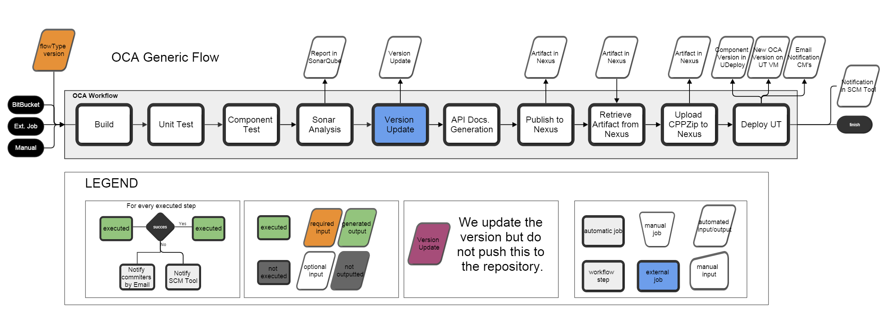
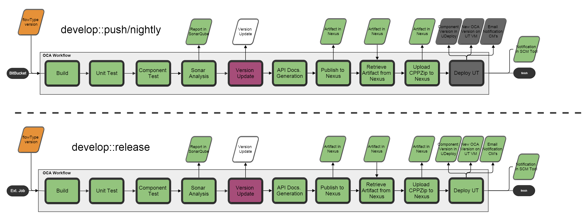
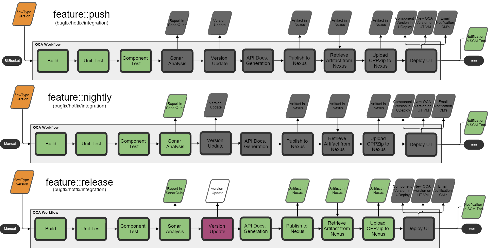
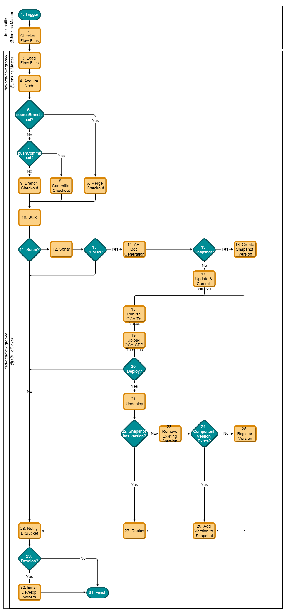
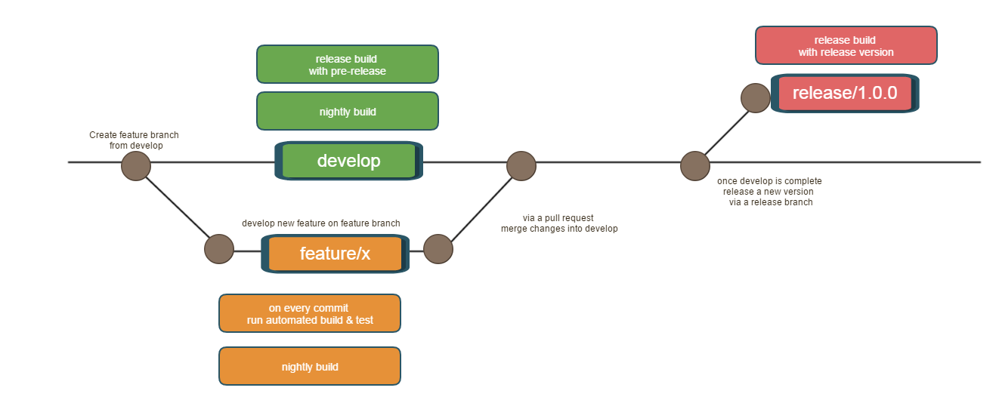

# OCA Flow
# Tools

* Jenkins: https://p-jenkins.nl.eu.abnamro.com:9443/
* SonarQube: http://p-sonarqube.nl.eu.abnamro.com:9000/
* Nexus 2: p-nexus.nl.eu.abnamro.com:8443/nexus
* Nexus 3 (for NPM): p-nexus-3.nl.eu.abnamro.com:8443/nexus
* BitBucket (GIT): p-bitbucket.nl.eu.abnamro.com:7999

Not well supported as of now: Subversion: p-subversion.nl.eu.abnamro.com:10443/csvn/

# Flow types
* Push
    * triggered by notification from BitBucket
    * should be a build per commit
    * should include packaging & unit tests
* Nightly
    * triggered by multi-branch's timer
    * should build every night
    * should include static analysis, such as SonarQube, maybe also Fortify/Nexus IQ
* Release
    * triggered by person
    * does what a nightly does, but goes further
    * automatic deploy to first staging environment (UT)
    * executes integration and functional tests of this environment
    * continues staging for as far as possible

# Expected way of working
* standardized naming for components, job names, artifacts, etc...
* automated build that can run on Jenkins without installation or configuration that isn't automated in the build
    * exceptions there, if you need a specfic tool, contact Software Logistics
* automated tests that can run on Jenkins without installation or configuration that isn't automated in the build

## Pipeline
### Flow in Jenkins
***Here follows the OCA pipeline general flow***

***Pipeline flows for the develop branch***

***Pipeline flows for branches other than develop/release***

***Flow definition file***

### Flow steps explained
The flow starts when the pipeline job gets started by a trigger.
Firstly Jenkins will checkout the Jenkinsfile on the Master node and execute this script.

1. **Triggers** The pipeline can be triggered in several different ways
    1. **BitBucket**: Via the [Jenkins Webhook for BitBucket}(https://marketplace.atlassian.com/plugins/com.nerdwin15.stash-stash-webhook-jenkins/server/overview)
    2. **External Job**:  A different Jenkins job calling a pipeline job directly 
    3. **Manual**: A user starting the job  
2. **Checkout flow files** checkout the solo-pipeline project that contains the "flow" (fed-oca-flow.groovy, Steps.groovy etc) files
3. **Load flow files** loads the fed-oca-flow.groovy file and starts the flow execution 
4. **Acquire node** first thing the flow needs to do is acquire a node (buildslave) to build on
5. **sourceBranch set?:** if the property sourceBranch is not 'empty', it means we got a trigger based on a Pullrequest in BitBucket
6. **Merge checkout** because we have a Pullrequest (PR) we want to have a checkout where we merge the sourceBranch with the targetBranch to confirm the PR works
7. **pushCommit set?** if the property pushCommit is set, we know we have a build that was triggered by a commit (push) to BitBucket with a CommitId
8. **CommitId checkout:** if we have an explicit commitId, we want to checkout this exact commit
9. **Branch checkout** if we do not have any specific information (if manually executed for example) we will simply checkout the branch
10. **Build** do the npm build (npm install)
11. **Sonar?** execute sonar stage IF: flowType == nightly OR flowType == release OR branchName == develop
12. **Sonar** execute a sonar analysis via the SonarQube runner tool
13. **Publish?** execute publish stage IF: branchName == develop OR (branchName contains 'feature/' AND flowType == release)
14. **API Doc Generation** uses Gulp to generate the API Documentation
15. **Snapshot?** we make a snapshot version IF: branchName does not contain 'release/', if it does we do step 16
16. **Create Snapshot version** a snapshot version has a alternative versioning scheme: <version>-<branchName>-<timestamp>-<commit short hash>
    1. **version**: the version from the package.json
    2. **branchName**: if it is develop branch, we leave it out, else we use a normalized branchname (replaces xxxxx/ to x_, e.g. feature/xx becomes f_xx) 
    3. **timestamp**: format is yyyyMMddHHmm, e.g. 201607181000 (July 10th 2016 at 10:00)
    4. **commit short hash**: a git commit has a commit hash, which is quite long, so we use the [git short hash](https://git-scm.com/book/tr/v2/Git-Tools-Revision-Selection)
17. **Update & Commit version** update the npm version (in the package.json) via npm version command
    1. this is done in a separate job so we can use the [Git Plugin](https://wiki.jenkins-ci.org/display/JENKINS/Git+Plugin)'s Publisher step to push the update package.json back to the repository's origin remote
    2. unfortunately, this step is not yet pipeline compatible, [see here](https://issues.jenkins-ci.org/browse/JENKINS-28335) so we used a external job to perform this  
18. **Publish OCA to Nexus**  uses npm publish to register and upload the artifact to Nexus
19. **Upload OCA-CPP to Nexus** downloads the npm artifact from Nexus, extracts the oca-cpp zip and uploads this zip to Nexus (so it can be used by UDeploy)
20. **Deploy?** we deploy the application IF: flowType == release AND branchName == develop
    1. please note: regarding UDeploy steps, we recognize the following items
    2. **Snapshot**: the concept of Snapshot in UDeploy, e.g. UT-879-HEAD
    3. **Component**: the concept of Component in UDeploy, e.g. WAS_HAY.oca-cpp (WAS_HAY is the application the component is part of)
    4. **VM**: the concept of environment in UDeploy, in our case those are all VM's (e.g. WAS_DEV_HAY_vm00000879)
    5. **Component Version**: any version of the component is its own entity in UDeploy, so *oca-cpp 1.20.1* is a seperate object from *oca-cpp 1.20.2*
    6. **Process**: UDeploy has processes available for OCA related VM's, these processes execute scripts to perform tasks for us on the VM on in UDeploy itself
21. **Undeploy** via UDeploy, we undeploy the Snapshot from the VM 
22. **Snapshot has version?** if the ***Snapshot*** already contains the OOCA ***Component*** (WAS_HAY.oca-cpp) version that we intend to add to the ***Snapshot***
23. **Remove existing version** remove the current ***Component Version*** of the OCA component from the Snapshot 
24. **Component version exists?** check if the ***Component Version*** is already known in UDeploy
25. **Register version** if the ***Component Version*** is not yet known in UDeploy, we register it (via the update.artifact.version process)
26. **Add version to snapshot** we attach the ***Component Version*** to the ***Snapshot***
27. **Deploy** we execute the UDeploy process *deploy* with the selected Snapshot on the target ***VM***
28. **Notify BitBucket** we do a http post to BitBucket on the commitId to set the current build status on this commit
29. **Develop?** check if this is the develop branch  
30. **Email Develop writers** send a email to the people who are writers on the OCA's develop branch
31. **Finish** 

### Flow chart Pipeline script

## Branching strategy
Makes no difference.
Both trunk based and feature based branching strategies are supported.
If you do not use branches, you can do with just a Pipeline job.
Otherwise, use the Multi-Branch job to make use of the automatic branch discovery
    * that creates a new job for you automatically

# Way of working

